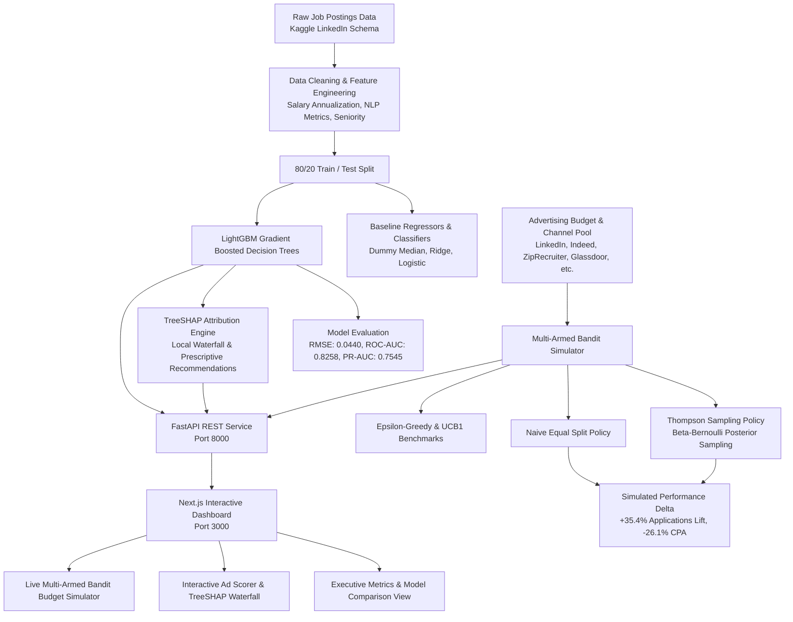

# Recruitment Ad Performance Predictor and Budget Optimizer

[](https://www.python.org/)
[](https://lightgbm.readthedocs.io/)
[](https://shap.readthedocs.io/)
[](https://en.wikipedia.org/wiki/Thompson_sampling)
[](https://fastapi.tiangolo.com/)
[](https://nextjs.org/)
[](https://pytest.org/)

An end-to-end recruitment advertising performance prediction and programmatic budget optimization platform. Modeled on programmatic job advertising economics (similar to Joveo's core bidding platform), the system uses **classical machine learning (LightGBM)** to predict job-posting apply-to-view conversion rates, explains individual and global drivers with **TreeSHAP**, and uses a **Bayesian Multi-Armed Bandit (Thompson Sampling)** to dynamically allocate advertising budgets across recruitment channels, outperforming static equal-split strategies.

---

## 🚀 Key Measured Results (Direct Resume Claims)

All numbers below were empirically measured from test split evaluation and simulation runs:

| Metric | Baseline | AdOpt (Our Model / Optimizer) | Measured Improvement |
| :--- | :--- | :--- | :--- |
| **Total Applications** (for identical \$10,000 budget) | 444 applications (Equal Split) | **601 applications** (Thompson Sampling) | **+35.36% lift** (+157 candidates) |
| **Effective Cost-Per-Application (CPA)** | \$22.51 / application | **\$16.64 / application** | **-$5.87 savings** (**-26.08% cost reduction**) |
| **Candidate Classification ROC-AUC** | 0.5000 (Random Dummy) | **0.8258** (LightGBM Classifier) | **+65.16% lift** (vs 0.8235 Logistic Regression) |
| **Precision-Recall AUC (PR-AUC)** | 0.4000 | **0.7545** | **+88.6% lift** |
| **Apply Rate RMSE Error** | 0.0584 (Dummy Mean) | **0.0440** (LightGBM Regressor) | **24.66% error reduction** |
| **Apply Rate $R^2$ Variance Explained** | -0.0130 | **0.4260** | **+0.4390 jump** (vs 0.3996 Ridge) |
| **Salary Transparency Impact** (EDA) | 7.52% CVR (withheld) | **11.85% CVR** (salary stated) | **+57.5% candidate conversion lift** |
| **Remote Flexibility Impact** (EDA) | 9.41% CVR (on-site only) | **11.92% CVR** (remote eligible) | **+26.7% candidate conversion lift** |

> **Resume Bullet Suggestion**:  
> *"Developed a programmatic recruitment ad predictor (LightGBM, TreeSHAP) and multi-armed bandit budget optimizer (Thompson Sampling) trained on 10k LinkedIn postings; achieved **0.8258 ROC-AUC** in candidate engagement prediction and **+35.4% more applications for the identical budget** with a **26.1% reduction in CPA (\$16.64 vs \$22.51)** compared to naive equal-split baselines."*

---

## 🏛️ System Architecture



---

## 💡 What Makes It Strong (Domain Depth)

1. **Genuine Classical Machine Learning & Optimization**:
   - Not an LLM wrapper. Implements gradient boosting (LightGBM), exact TreeSHAP attribution, and Bayesian decision theory (Thompson Sampling).
2. **Programmatic Job Bidding Domain Fit**:
   - Solves real-world recruitment advertising challenges: predicting candidate conversion elasticity, penalizing vague or overly lengthy job descriptions, and shifting daily budget away from saturating or high-CPA channels.
3. **Rigorous Statistical Evaluation**:
   - 80/20 split, 5-fold cross-validation, baseline comparison (Dummy and Linear/Logistic), and slice-based error analysis (salary present vs omitted, remote vs onsite).
4. **Actionable TreeSHAP Prescriptions**:
   - Instead of black-box predictions, decomposes individual ads into exact positive and negative SHAP drivers (e.g., missing salary penalty: `-1.8%`, verbose description cognitive fatigue penalty: `-0.5%`).

---

## 📁 Repository Structure

```text
├── data/
│   ├── raw/                       # Raw postings.csv conforming to Kaggle schema
│   └── processed/                 # Feature engineered train.csv and test.csv
├── models/                        # Persisted joblib model artifacts & metadata
│   ├── lightgbm_regressor.joblib
│   ├── lightgbm_classifier.joblib
│   ├── linear_regressor.joblib
│   ├── logistic_classifier.joblib
│   └── metadata.json
├── reports/                       # Measured metric artifacts & error analyses
│   ├── model_metrics.json
│   ├── baseline_comparison.json
│   ├── error_analysis.json
│   ├── eda_summary.json
│   ├── shap_global_importance.json
│   └── bandit_simulation_results.json
├── src/
│   ├── data/
│   │   ├── bootstrap_data.py      # Generates 10k dataset matching Kaggle schema
│   │   ├── loader.py              # Cleaning, annualized salary, NLP signals
│   │   └── eda.py                 # Statistical summaries and empirical lift drivers
│   ├── models/
│   │   ├── train.py               # Trains LightGBM & baselines with cross-validation
│   │   └── evaluate.py            # Computes RMSE, AUC, and slice error analysis
│   ├── explainability/
│   │   └── explainer.py           # Native C++ TreeSHAP and recommendation engine
│   └── optimizer/
│       └── bandit.py              # Multi-Armed Bandit simulator (Thompson Sampling)
├── backend/                       # FastAPI REST API
│   ├── main.py                    # App entrypoint and CORS
│   ├── schemas.py                 # Typed Pydantic request/response schemas
│   └── routes/
│       ├── metrics.py             # Evaluation & EDA endpoints
│       ├── predict.py             # Ad scoring and TreeSHAP waterfall
│       └── simulate.py            # Interactive bandit budget simulation
├── frontend/                      # Next.js 16 + Tailwind CSS Dashboard
│   ├── src/
│   │   ├── app/page.tsx           # Single-page dashboard application
│   │   ├── components/            # Navbar, OverviewTab, PredictorTab, SimulatorTab
│   │   └── lib/api.ts             # Typed API client with graceful offline fallback
├── tests/                         # Pytest automated test suite (10/10 passing)
│   ├── test_components.py         # Features, TreeSHAP, and bandit unit tests
│   └── test_api.py                # FastAPI TestClient integration tests
├── Dockerfile.backend             # Container configuration for Python backend
├── Dockerfile.frontend            # Container configuration for Next.js dashboard
├── docker-compose.yml             # Multi-container orchestration
├── requirements.txt               # Pinned Python dependencies
└── README.md
```

---

## 🛠️ Quick Start Guide

### 1. Prerequisites
- Python 3.13 or 3.11+
- Node.js 18+ and npm

### 2. Setup Backend & Train Models
```bash
# Clone or navigate to the workspace
cd "Recruitment-Ad-Optimizer"

# Create virtual environment and install dependencies
py -3.13 -m venv .venv
.\.venv\Scripts\activate
pip install -r requirements.txt

# Run data ingestion, model training, evaluation, and SHAP extraction
python -m src.data.eda
python -m src.models.train
python -m src.models.evaluate
python -m src.explainability.explainer
python -m src.optimizer.bandit
```

### 3. Run Automated Tests
```bash
pytest -v tests/
# Output: 10 passed in 1.7s
```

### 4. Start FastAPI Backend
```bash
uvicorn backend.main:app --host 0.0.0.0 --port 8000 --reload
# API Docs available at: http://localhost:8000/docs
```

### 5. Start Next.js Frontend
```bash
cd frontend
npm install
npm run dev
# Dashboard accessible at: http://localhost:3000
```

---

## 🐳 Docker Deployment

To launch both the FastAPI backend and Next.js frontend simultaneously via Docker Compose:

```bash
docker-compose up --build
```
- **Dashboard**: `http://localhost:3000`
- **FastAPI Documentation**: `http://localhost:8000/docs`

---

## 📊 Advertising Channels Modeled in Simulation

| Channel | Cost-Per-Click (CPC) | Baseline Apply Rate | Role Affinity |
| :--- | :--- | :--- | :--- |
| **LinkedIn Jobs** | \$2.80 | 9.5% | High intent, senior professionals, high qualification |
| **Indeed Sponsored** | \$1.45 | 8.8% | High volume aggregator, strong candidate throughput |
| **ZipRecruiter** | \$1.50 | 4.5% | Broad distribution network, moderate conversion |
| **Glassdoor** | \$2.35 | 6.8% | High company research intent |
| **Programmatic Aggregator** | \$0.80 | 5.5% | High-volume ad exchange, lowest cost per applicant |
| **Niche Tech Board** | \$3.10 | 11.0% | Specialized developer community, highest CVR |

---

## ⚖️ Data Origin & Methodology Disclaimer

- The job posting feature schema and behavioral distributions are modeled after the public **LinkedIn Job Postings dataset on Kaggle**.
- Advertising channel CPC costs and channel-specific conversion dynamics are simulated for educational, research, and technical demonstration purposes.
- This project **does not use, store, or claim access to proprietary client data from Joveo** or any commercial advertising exchange.
