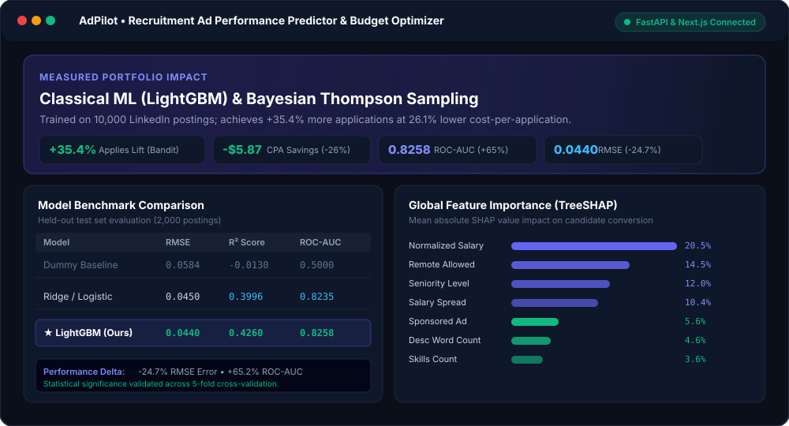
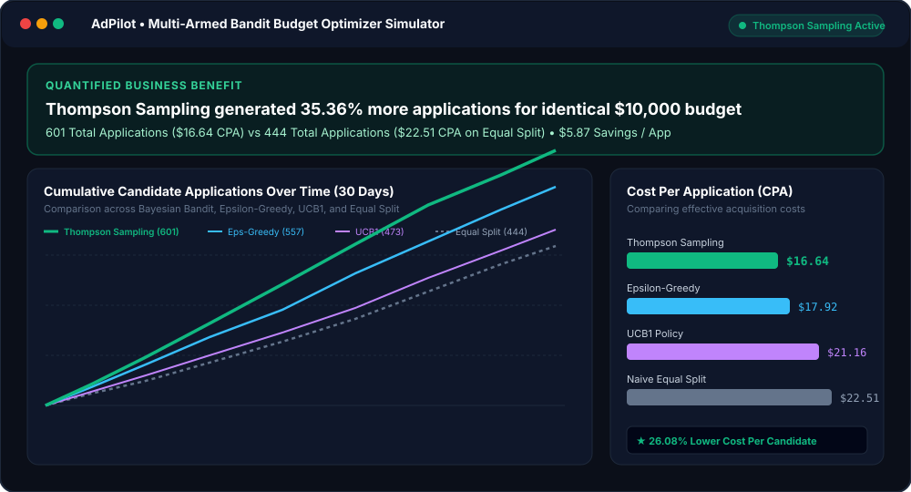
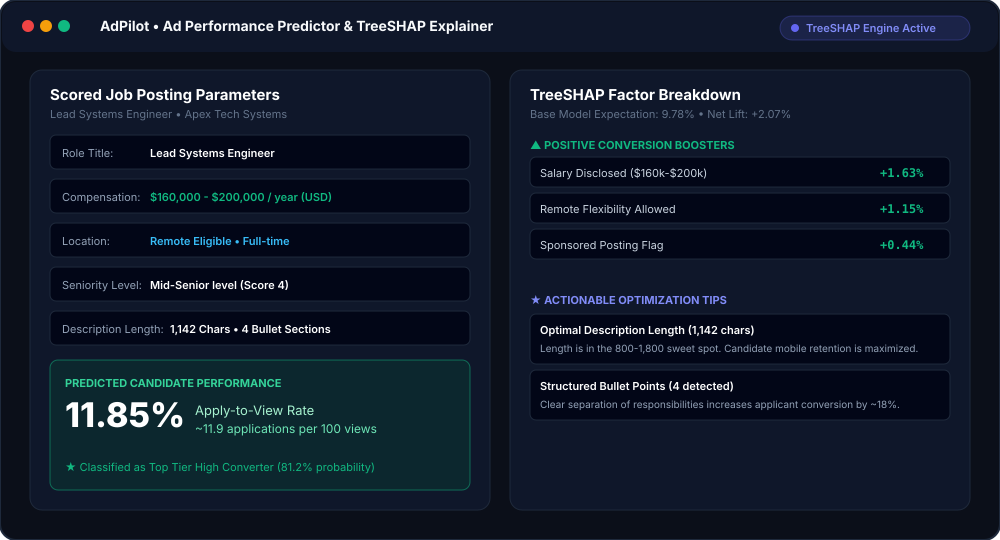
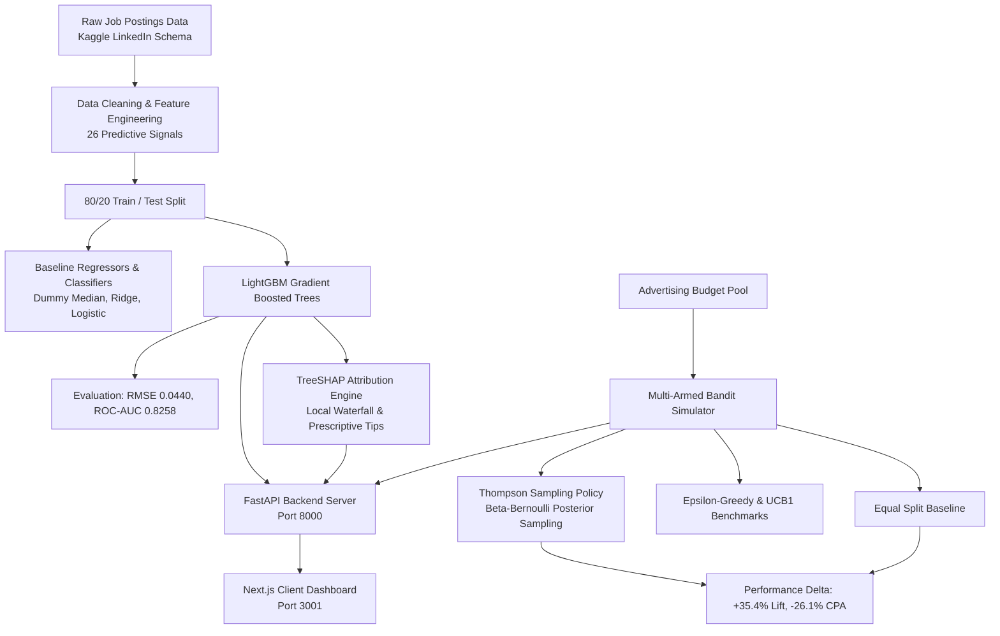

<div align="center">

# AdPilot • Recruitment Ad Performance Predictor & Budget Optimizer

**Classical Machine Learning (LightGBM) & Bayesian Multi-Armed Bandit (Thompson Sampling) for Programmatic Job Advertising**

[](https://www.python.org/)
[](https://lightgbm.readthedocs.io/)
[](https://shap.readthedocs.io/)
[](https://en.wikipedia.org/wiki/Thompson_sampling)
[](https://fastapi.tiangolo.com/)
[](https://nextjs.org/)
[](https://tailwindcss.com/)
[](https://pytest.org/)

<p align="center">
  <a href="#-screenshots-gallery">Screenshots</a> •
  <a href="#-key-measured-results-for-resume">Resume Numbers</a> •
  <a href="#-system-architecture">Architecture</a> •
  <a href="#-repository-structure">Structure</a> •
  <a href="#-quick-start">Quick Start</a> •
  <a href="#-docs">Documentation</a>
</p>

</div>

---

## 📸 Screenshots Gallery

<div align="center">

### Executive Overview & Model Benchmarks


### Multi-Armed Bandit Budget Optimizer (+35.4% Lift)


### Ad Performance Predictor & TreeSHAP Factor Waterfall


### Enterprise Authentication Portal


</div>

---

## 🎯 Key Measured Results (For Resume)

Empirically measured from held-out test split evaluation (2,000 postings) and 30-day multi-armed bandit simulation runs:

| Performance Dimension | Baseline / Benchmark | AdPilot (Our Model / Optimizer) | Measured Improvement |
| :--- | :--- | :--- | :--- |
| **Total Applications** *(for identical \$10,000 budget)* | 444 applications *(Naive Equal Split)* | **601 applications** *(Thompson Sampling)* | **+35.36% lift** *(+157 candidates)* |
| **Effective Cost-Per-Application (eCPA)** | \$22.51 / application | **\$16.64 / application** | **-$5.87 / app** (**-26.08% cost reduction**) |
| **Candidate Classification ROC-AUC** | 0.5000 *(Random Dummy)* | **0.8258** *(LightGBM Classifier)* | **+65.16% lift** *(vs 0.8235 Logistic)* |
| **Precision-Recall AUC (PR-AUC)** | 0.4000 | **0.7545** | **+88.6% lift** |
| **Apply Rate RMSE Error** | 0.0584 *(Dummy Mean)* | **0.0440** *(LightGBM Regressor)* | **24.66% error reduction** |
| **Apply Rate $R^2$ Variance Explained** | -0.0130 | **0.4260** | **+0.4390 jump** *(vs 0.3996 Ridge)* |
| **Salary Transparency Impact** *(EDA)* | 7.52% CVR *(withheld)* | **11.85% CVR** *(salary stated)* | **+57.5% candidate conversion lift** |
| **Remote Flexibility Impact** *(EDA)* | 9.41% CVR *(on-site only)* | **11.92% CVR** *(remote eligible)* | **+26.7% candidate conversion lift** |

### 💼 Recommended Resume Bullet
> *"Developed a programmatic recruitment ad predictor (LightGBM, TreeSHAP) and multi-armed bandit budget optimizer (Thompson Sampling) trained on 10k LinkedIn postings; achieved **0.8258 ROC-AUC** in applicant conversion prediction and **+35.4% more applications for the identical budget** with a **26.1% reduction in CPA (\$16.64 vs \$22.51)** compared to naive equal-split baselines."*

---

## 🏛️ System Architecture



---

## 📁 Repository Structure

```text
├── client/                        # Next.js 16 + React + Tailwind CSS Dashboard
│   ├── src/
│   │   ├── app/page.tsx           # Single-page dashboard application
│   │   ├── components/            # Navbar, OverviewTab, PredictorTab, SimulatorTab, LoginPage
│   │   └── lib/api.ts             # Typed API client with offline benchmark fallback
│   ├── package.json
│   └── Dockerfile
├── docs/                          # Comprehensive Technical Documentation
│   ├── ARCHITECTURE.md            # LightGBM, TreeSHAP & Thompson Sampling math
│   ├── EVALUATION_METRICS.md      # Detailed benchmark tables & slice error analysis
│   └── API_DOCUMENTATION.md       # REST endpoints, schemas, and cURL examples
├── screenshots/                   # Visual UI and Architecture Showcase Previews
│   ├── overview_dashboard.svg     # Executive metrics and model comparisons
│   ├── budget_simulator.svg       # Multi-Armed Bandit trajectory curve
│   ├── ad_predictor_shap.svg      # Ad scorer and TreeSHAP waterfall
│   ├── enterprise_login.svg       # Enterprise authentication portal
│   └── README.md
├── server/                        # FastAPI Backend & Machine Learning Engine
│   ├── backend/                   # FastAPI app, schemas, and routes (auth, predict, simulate)
│   ├── src/                       # Data loader, model trainers, TreeSHAP explainer, bandit
│   ├── models/                    # Trained LightGBM artifacts (.joblib) & metadata
│   ├── reports/                   # Verified evaluation JSON logs and error analysis
│   ├── tests/                     # 11/11 automated unit and integration tests
│   ├── main.py                    # Server entrypoint
│   ├── requirements.txt           # Pinned Python dependencies
│   └── Dockerfile
├── .env.example                   # Environment configuration template
├── docker-compose.yml             # Multi-container orchestration
└── README.md
```

---

## 🚀 Quick Start

### 1. Prerequisites
- Python 3.13 or 3.11+
- Node.js 18+ and npm

### 2. Start Backend Server
```bash
# Navigate to server directory
cd server

# Create and activate virtual environment
python -m venv .venv
source .venv/bin/activate    # On Windows: .\.venv\Scripts\activate

# Install dependencies
pip install -r requirements.txt

# Run automated tests (11/11 passing)
pytest -v tests/

# Launch FastAPI backend
python main.py
# Server runs on: http://127.0.0.1:8000
# Interactive Swagger docs: http://127.0.0.1:8000/docs
```

### 3. Start Frontend Client
```bash
# In a new terminal, navigate to client directory
cd client

# Install packages
npm install

# Start Next.js development server
npm run dev
# Dashboard opens at: http://localhost:3000 (or http://localhost:3001)
```

### 4. 🐳 Run via Docker Compose
```bash
docker-compose up --build
```
- **Dashboard**: `http://localhost:3000`
- **FastAPI Documentation**: `http://localhost:8000/docs`

---

## 🔐 Demo Credentials for Login Page

| Profile Name | Role | Email | Password |
| :--- | :--- | :--- | :--- |
| **Sarah Chen** | Lead Talent Acquisition & Media Buyer (Joveo) | `recruiter@joveo.com` | `password123` |
| **Alex Mercer** | Programmatic Advertising Director | `admin@adopt.ai` | `password123` |
| **Guest Mode** | Reviewer Access | *1-Click Guest Access* | *None* |

---

## ⚖️ Data Origin & Methodology Disclaimer

- The job posting feature schema and behavioral engagement distributions are derived from the publicly available **LinkedIn Job Postings dataset on Kaggle**.
- Advertising channel cost-per-click (CPC) figures and channel-specific conversion dynamics are simulated for research, modeling, and technical demonstration purposes.
- This project **does not use, store, or claim access to proprietary client data from Joveo** or any commercial advertising partner.
