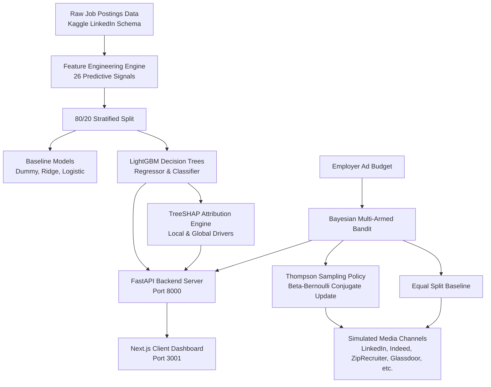

# System Architecture & Technical Specifications

AdPilot is a programmatic recruitment ad performance predictor and dynamic budget optimizer built to solve key media-buying inefficiencies in talent acquisition.

**🌐 Live Demo**: [https://gauravguptanoida19-bit.github.io/AdPilot-AI-Job-Ad-Performance-Predictor-Budget-Optimizer/](https://gauravguptanoida19-bit.github.io/AdPilot-AI-Job-Ad-Performance-Predictor-Budget-Optimizer/)

## 1. Classical Machine Learning Pipeline

### Data & Feature Engineering
- **Normalized Annual Salary**: Annualized across Hourly, Monthly, and Yearly pay structures, with dedicated missingness indicators (`has_salary`) and spread metrics (`salary_spread`).
- **Cognitive Text Length & Readability**: Description character count, word count, and bullet-point marker counts to quantify mobile cognitive fatigue.
- **Seniority & Title Parsing**: Categorized from 0 (Internship) to 5 (Executive).
- **Geographic Elasticity**: `is_remote`, `loc_tier_1`, and `loc_tier_2` indicators.
- **Temporal Drivers**: Day of week, hour of listing, and weekend posting flags.

### Algorithms
- **LightGBM Regressor**: Gradient boosted trees minimizing RMSE on candidate application rates ($applies / views$).
- **LightGBM Classifier**: Gradient boosted trees optimizing ROC-AUC on top-tier candidate conversion likelihood.

## 2. TreeSHAP Attribution Engine
TreeSHAP decomposes predictions into additive feature attributions:
$$f(x) = \phi_0 + \sum_{i=1}^M \phi_i(x)$$
Where $\phi_0$ represents the base expected application rate across the training distribution, and $\phi_i(x)$ denotes the exact positive or negative contribution of feature $i$ on the current posting.

## 3. Bayesian Multi-Armed Bandit (Thompson Sampling)
Advertising channels are modeled as stochastic arms with unknown true conversion rates $p_k \in (0, 1)$ and variable Cost-Per-Click $\text{CPC}_k$:
1. **Prior Distribution**: Each arm maintains a conjugate Beta prior $\text{Beta}(\alpha_k, \beta_k)$.
2. **Posterior Sampling**: On each round $t$, sample $\hat{p}_k \sim \text{Beta}(\alpha_k, \beta_k)$.
3. **Efficiency Weighting**: Compute expected applications per dollar $e_k = \hat{p}_k / \text{CPC}_k$.
4. **Softmax Allocation**: Distribute the daily budget $B_t$ with exploration floors to continually learn while heavily exploiting top-performing channels.
5. **Bayesian Update**: Observe clicks $c_k$ and applications $a_k$:
   $$\alpha_k \leftarrow \alpha_k + a_k, \quad \beta_k \leftarrow \beta_k + (c_k - a_k)$$
